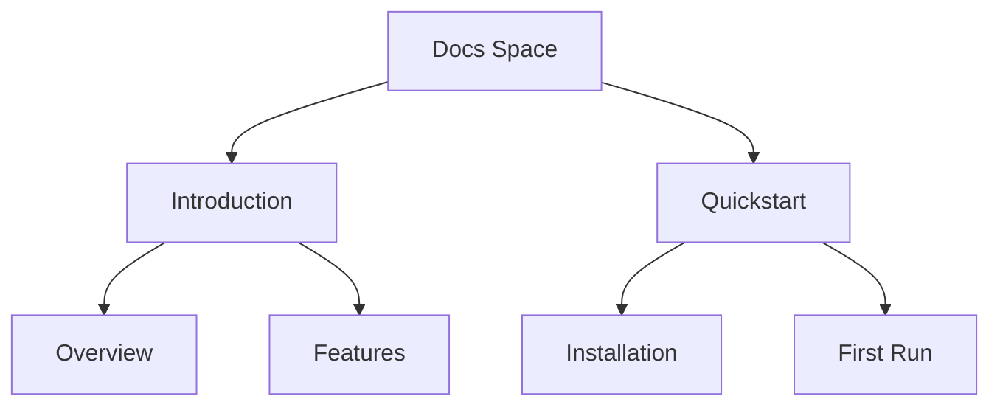

## Overview

Self-comp provides a flexible platform for managing your project's documentation. You organize content into spaces, build hierarchies, track versions, and collaborate seamlessly. Master these core concepts to create scalable, maintainable docs.

<Columns cols={2}>
  <Card title="Spaces & Organization" icon="folder" href="#spaces">
    Group related docs into dedicated spaces for better navigation.
  </Card>
  <Card title="Page Hierarchies" icon="layout" href="#hierarchies">
    Structure pages with nesting and links for intuitive flows.
  </Card>
  <Card title="Versioning" icon="git-branch" href="#versioning">
    Maintain history and publish versioned docs effortlessly.
  </Card>
  <Card title="Collaboration" icon="users" href="#collaboration">
    Work with teams using reviews, comments, and merges.
  </Card>
</Columns>

## Documentation Spaces and Organization

You create documentation spaces to separate concerns, such as user guides from API references. Each space acts as a self-contained site with its own navigation, themes, and permissions.

<Callout kind="tip">
  Start with one space per major project area to avoid clutter.
</Callout>

<Steps>
  <Step title="Create a Space" icon="plus">
    Navigate to the dashboard and select "New Space". Enter a name like "User Guide".
  </Step>
  <Step title="Add Pages" icon="file-plus">
    Within the space, create your first page using the MDX editor.
  </Step>
  <Step title="Organize Navigation" icon="menu">
    Drag pages in the sidebar to set the order.
  </Step>
</Steps>

## Page Hierarchies and Linking

Build intuitive structures with nested pages and cross-links. Use frontmatter for metadata and anchor links for in-page navigation.



Link pages with relative paths:

````mdx
[Go to Quickstart](/quickstart)
[Anchor link](#features)
````

## Versioning and History Tracking

Self-comp tracks changes automatically. You branch docs for releases and publish specific versions.

<Tabs>
  <Tab title="Branching" icon="git-branch">
    Create a branch from main:
    
````bash
git checkout -b v2.0-docs
````
  </Tab>
  <Tab title="Tagging" icon="tag">
    Tag releases:
    
````bash
git tag v1.0.0
git push origin v1.0.0
````
  </Tab>
  <Tab title="Publishing" icon="globe">
    Deploy a version via dashboard:
    
    Select branch and click "Publish Version".
  </Tab>
</Tabs>

<CodeGroup tabs="YAML,JSON">
````yaml
---
title: "Introduction"
version: "2.0"
sidebar: "main"
---
````
```json
{
  "title": "Introduction",
  "version": "2.0",
  "sidebar": "main"
}
```
</CodeGroup>

## Collaboration Workflows

Invite team members with role-based access. Review changes via pull requests before merging.

<Expandable title="Advanced Workflow" default-open="false">
  Use these steps for team reviews:

  <Steps>
    <Step title="Fork Space">
      Duplicate for experimentation.
    </Step>
    <Step title="Submit PR">
      Push changes and open pull request.
    </Step>
    <Step title="Review & Merge">
      Comment, approve, then merge to main.
    </Step>
  </Steps>
</Expandable>

<Callout kind="info">
  Enable notifications for @mentions to stay in sync.
</Callout>

## Best Practices

- Limit nesting to three levels for usability.
- Use consistent frontmatter across pages.
- Tag versions semantically (v{major}.{minor}.{patch}).

These concepts form the foundation. Apply them to scale your documentation effectively.